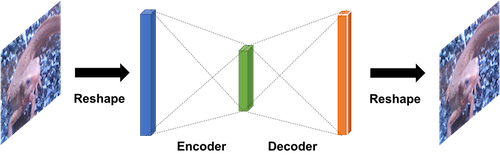

# Q. 画像生成編

ここでは画像生成の手法を自分の手で実装していきます。**とりあえずPyTorch, Tensorflow, Keras, Chainer全部で実装してください。**
ネットワークを作ったら、学習率やイテレーションを変えて、テストデータセット *../Dataset/test/images* でテストしてみてください。
**画像生成では学習データの数が非常に重要になってきます。なので、データ拡張をできる限り多く使って下さい**、もしくはMNISTやCIFAR10のデータセットを使った方がいいかもしれません。

## Q. Auto Encoder

まずは基本的なAuto encoderから。これは画像の表現方法をモデルに学習させること、特徴の次元圧縮を目的に行われます。

AEはよく2層ネットワークで表される。入力層、中間層(Encoder・エンコーダー)、出力層(Decoder・デコーダー)であり、出力が入力画像と同じになるように学習が行われます。中間層のユニット数は入力、出力のものよりずっと小さく、砂時計型である。これが特徴表現の次元圧縮を実現してます。

ここでは次の構造を取る。

input=64, width=64, channel=3 とする。

1. Input = (height, width, channel)
2. MLP(64)
3. MLP(height x width x channel)

画像を[-1, 1]に正規化する。出力層には活性化関数を使わず、LossはMeanSquaredErrorとする。最適化はAdamで学習率は0.001、イテレーション回数は1000としてKerasを使った例はこんな感じ。なんとなく色味を見た感じ復元できているように思えます。よくAutoEncoderでググるとMNISTを使った例がよく出るんだけど、MNISTは0, 1の値だけで構成されているので分散が小さくタスクとして簡単です。一方イモリの画像は値がいろいろあって分散が大きい難しいタスクであるので、結果が微妙に見えてしまいます。

| answer_ae_keras_akahara_0009.png | answer_ae_keras_akahara_0009.png |
|:---:|:---:|
 |  | 

答え
- Pytorch [answers/ae_pytorch.py](https://github.com/yoyoyo-yo/DeepLearningMugenKnock/blob/master/Question_model/answers/ae_pytorch.py)
- Keras [answers/ae_keras.py](https://github.com/yoyoyo-yo/DeepLearningMugenKnock/blob/master/Question_model/answers/ae_keras.py)

## Q. Convolutional Auto Encoder

AEはMLPのみの構成だったが、ここではConvolutoinとTransposed convolutionでAEを行う。SemaSegの時と似たようなネットワーク構造をとる。

モデル構成は、
1. Input = (height, width, channel)
2. Conv(kernel_num=32, kernel_size=3, padding=1, strfide=1)
3. Conv(kernel_num=16, kernel_size=3, padding=1, strfide=1)
4. TransposedConv(kernel_num=64, kernel_size=2, padding=0, strfide=2)
4. TransposedConv(kernel_num=channel, kernel_size=2, padding=0, strfide=2)

| answer_convae_pytorch_akahara_0011.png | answer_convae_pytorch_madara_0011.png |
|:---:|:---:|
 |  | 

答え
- Pytorch [answers/ae_pytorch.py](https://github.com/yoyoyo-yo/DeepLearningMugenKnock/blob/master/Question_model/answers/ae_pytorch.py)

## Q. GAN

論文 >> https://arxiv.org/abs/1406.2661

GAN とは*Generateive Adversarial Networks* の略です。最近はこのGANをベースにした手法だらけです。GANはGeneratorとDiscreminatorの２つが敵対(adverse)するのでこんな名前がついています。Generatoirは画像を生成するネットワーク、Discreminatorは画像がGeneratorが作ったか否かを分類するネットワークになっています。つまり **GANは画像を生成するニューラルネットワーク** です。

学習手法は、
1. Generatorが生成した画像にラベル0、生成したい画像にラベル1を割り当てる
2. 1のミニバッチでDiscriminatorを学習させる (Discriminatorだけの学習、Generatorは学習させない)
3. Generatoir + Discriminatorにノイズを入力して、ラベル1を割り当てる
4. 3でGeneratorを学習させる
これを1イテレーション毎に行います。これによってDisciminatorはGeneratorが生成した画像が否かを学習できるようになっています。

テスト時はGeneratorにノイズを入力して、生成した画像を得ることができます。つまり、GANの目的は、適当なノイズから作りたい画像を得ることです。学習データは画像を容易するだけでいいので、**教師なし学習**の一種とみなせるようです。

GANはピクセルごとにLossを取るAutoEncoderとは違い、画像を非間接的にGeneratorに学習させるところが大きく違っていて、これが精度よくできるので、ものすごく注目されてます。なんできれいな画像ができるかが、論文中の数式で証明されています。（詳しくはわかりませんでしたが、どうやら生成したい画像の確率分布を学習できます的なことが書いてあるようでした。）今ではGANの派生として、pix2pixやBigGANなどきれいな画像をすごくきれいに生成できる手法があります。最近(2019.3.1)だと存在しない人の顔を作るサイトなんかもかなり話題になりました。

なぜかGANの構造が論文に記載されていなくて、いろいろな人の実装を見るとこんな感じでした。生成したい画像サイズの縦をheight, 横をwidth, チャネル数をchannelとしてます。

**Generator**

1. Input = 100
2. MLP(256) + LeakyReLU(alpha=0.2) + BN
3. MLP(512) + LeakyReLU(alpha=0.2) + BN
4. MLP(1024) + LeakyReLU(alpha=0.2) + BN
5. MLP(height x width x channel) + sigmoid

**Disciminator**
1. Input  = (height, width, channel)
2. MLP(512) + LeakyReLU(alpha=0.2)
3. MLP(256) + LeakyReLU(alpha=0.2)
4. MLP(1) + sigomid

ちなみにGAN系は収束がくそ難しいことでも有名です。GANの学習ノウハウだけで論文が出てるほどです。なので、各種パラメータ調整はかなり厳しい戦いになると思います。がんばりましょう。僕もがんばりました(´；ω；｀)

答え
- Pytorch [answers/lenet_pytorch.py](https://github.com/yoyoyo-yo/DeepLearningMugenKnock/blob/master/Question_model/answers/lenet_pytorch.py)
- Keras [answers/lenet_keras.py](https://github.com/yoyoyo-yo/DeepLearningMugenKnock/blob/master/Question_model/answers/lenet_keras.py)

## DCGAN

論文 >> https://arxiv.org/abs/1511.06434

GANの進化版、DCGAN (Deep Convolutional GAN)。GANはMulti layer perceptronだけの構成でしたが、DCGANではconvolution層などを入れてきれいな画像が生成できるようになりました。

この論文はどっちかというとGANを学習させるコツが多く書かれています。

ネットワーク構成は

**Generator**

1. Input = 100
2. Dense( (height/16) x (width/16) x 512) + ReLU + BN
3. TransposedConv(kernel_size=(5,5), kernel_num=512, strides=2) + ReLU + BN
3. TransposedConv(kernel_size=(5,5), kernel_num=256, strides=2) + ReLU + BN
3. TransposedConv(kernel_size=(5,5), kernel_num=128, strides=2) + ReLU + BN
3. TransposedConv(kernel_size=(5,5), kernel_num=channel, strides=2) + tanh

**Disciminator**
1. Input  = (height, width, channel)
2. Conv(kernel_size=(5,5), kernel_num=32, stride=2) + LeakyReLU(alpha=0.2)
2. Conv(kernel_size=(5,5), kernel_num=64, stride=2) + LeakyReLU(alpha=0.2)
2. Conv(kernel_size=(5,5), kernel_num=128, stride=2) + LeakyReLU(alpha=0.2)
2. Conv(kernel_size=(5,5), kernel_num=256, stride=2) + LeakyReLU(alpha=0.2)
4. MLP(1) + sigomid
