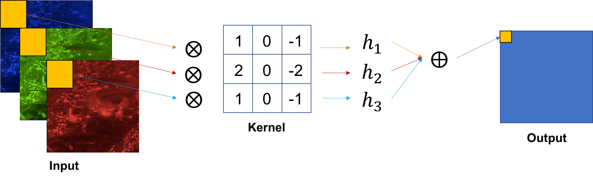
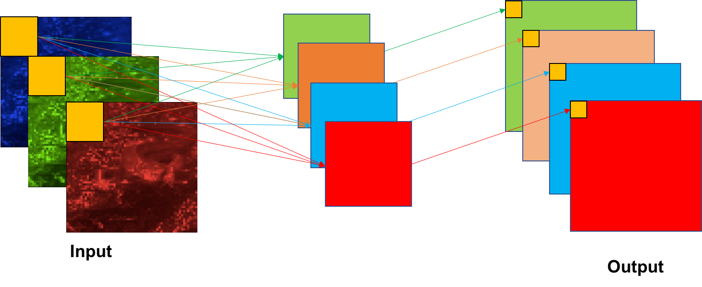
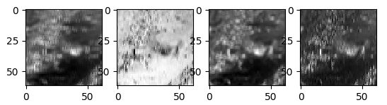

# Q. 理論編2

理論編1はこっち

> https://github.com/yoyoyo-yo/DeepLearningMugenKnock/blob/master/Question_theory/README.md

## Convolutional Layer

これまではニューラルネットをやってきました。ニューラルネットはそもそも認識のために提案されたものでした。認識とは一般的には(1)特徴抽出、(2)認識の２つのパートに別れます。

ここでちょっとだけ、ディープラーニングが流行る前までの歴史を見てみます。
(1)特徴抽出では、HOGやSIFTといった手法を用いて、画像から画像特有のたくさんの固定サイズの値をベクトルとしてまとめて、**特徴量**として扱ってました。例えばHOGという方法を用いると、画像の値の変化の大きい方向を特徴量として扱ってます。
(2)認識部では、特徴量を基に判別していました。
1. 人工知能第一次ブームではデータベース形式であり、学習データの特徴量を正解ラベルとペアにして保存していました。ただし、ただでさえハード技術が発達していなかった当時にメモリが不足するのは当たり前でした。（現代でもとても無謀ですが）
2. 人工知能第二次ブームでは機械学習が始まりました。SVM(Support Vector Machine)や決定木(Decision Tree)、Random Forestなど特徴量を基に所属クラスを予測する方法です。少し難しい話をすると、これはN次元の特徴量が存在する空間（**N次元特徴空間**）における**分離超平面**のパラメータを決定する方法です。各特徴量がこの分離超平面によって、それぞれが所属するクラスの部分空間に分けることができれば、クラス判別ができるということです。

現在のディープラーニングは第三次ブームであり、(1)特徴抽出、(2)認識を全て行ってしまいます。
そしてこれまでやってきたニューラルネットワークが(2)認識に当たります（ニューラルネットのみで認識することもありますが、基本的にはconvolutionによる特徴抽出部も使います。）。なので、ここではディープラーニングにおける(1)特徴抽出を行っていきます。

この特徴抽出がConvolutional Layerです。これはただのフィルタリングです。フィルタリングとは下の左の画像のように、フィルタと対応する値を乗算して、その和を求めることです。Convolutional Layerではこのフィルタのことを**Kernel（カーネル）** と呼びます。これをずらしながら計算することで、下の右画像のような演算を行います。これを**畳み込み** といいます。（信号処理の畳み込みとはちょっと違います。）

| フィルタリング | 画像全体への畳込み |
|:---:|:---:|
|  |  |

少し細かい話もあるのですが、それは後々やるとして、ここでは、akahara_0001.jpg を読み込んで、64 x 64 にリサイズして、畳み込みを行いましょう。

この時、入力は3チャネル(RGB)になります。このようにConvolutional Layerへの入力は複数チャネルになります。なので、実際のconvolution操作はこのようになります。

まず各チャネルにフィルタリングして、その結果の和を出力の1ピクセルにします。つまり、出力のチャネルはカーネル数と同じになります。

| 1カーネル | 4カーネル |
|:---:|:---:|
|  |  |

ここではニューラルネットのプログラムは一旦忘れて、akahara_0001.jpg を読み込み、3x3のサイズのランダムな値を持つ４つのカーネルで畳み込みしてみましょう。

カーネルは次のように定義してみましょう。

```python
import numpy as np
np.random.seed(0)
kernels = np.random.normal(0, 0.01, [3, 3, 4])
```

答え。これを見ると、それぞれ出力が違っています（ランダムなので当たり前ですが）。Deep Learningではこのカーネルが多くあること、convolutionが何層にもあることで様々な状態の出力を取ることができます。この出力が**特徴量** として扱われます。



答え >> [answers/conv_kernel.py]( https://github.com/yoyoyo-yo/DeepLearningMugenKnock/blob/master/Question_theory/answers/conv_kernel.py )

